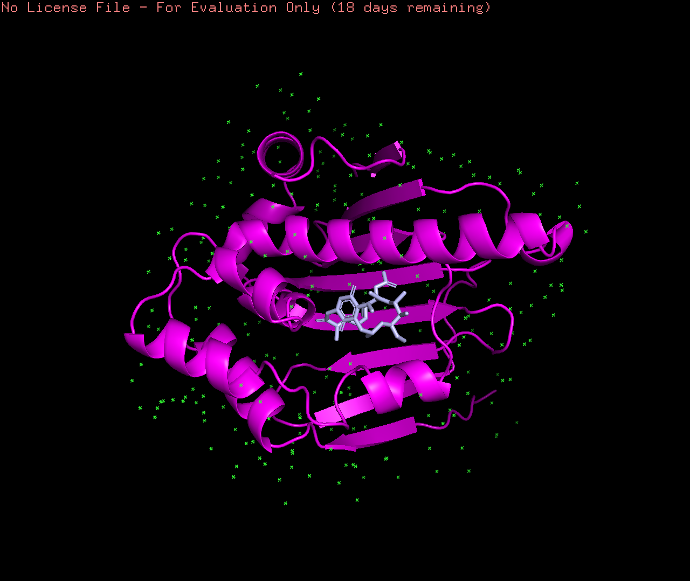
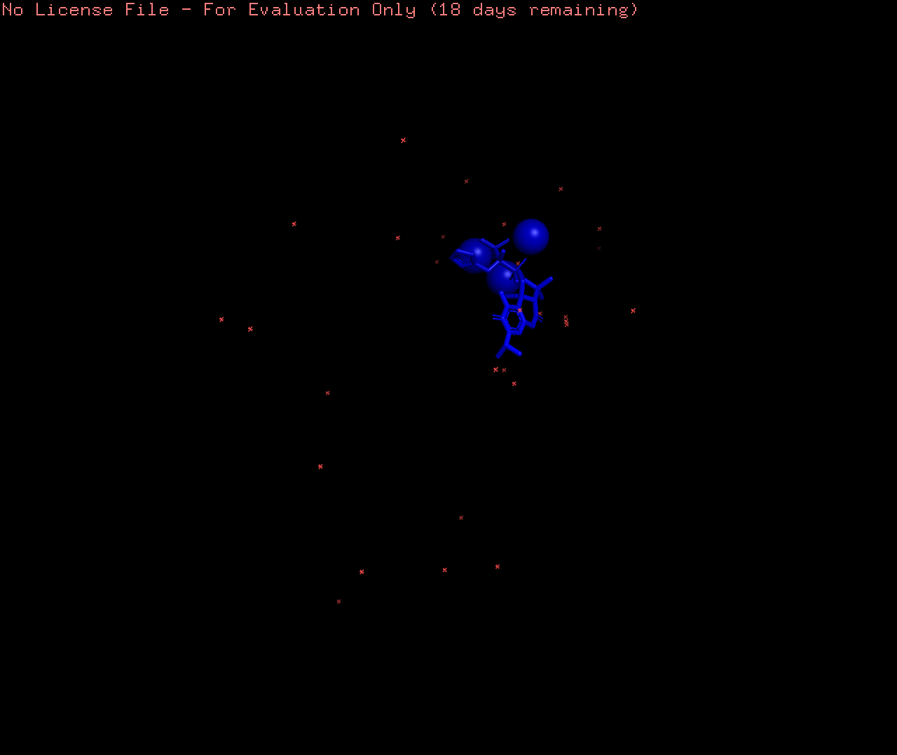
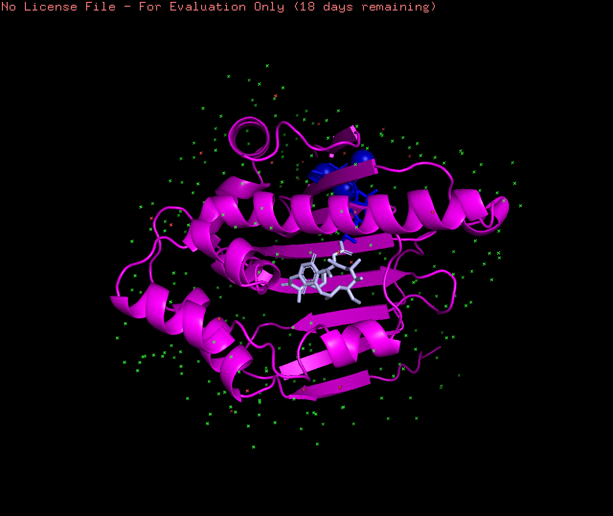

# Introduction

## Scientific Question

How effective is the HSP90 inhibitor celastrol as a drug, considering it does not conventionally bind to HSP90?

## Background on Protein of Interest

Source: https://www.pnas.org/doi/abs/10.1073/pnas.0903392106 & https://aacrjournals.org/cancerres/article/67/7/2932/534569/High-HSP90-Expression-Is-Associated-with-Decreased

My protein of interest in this project is HSP90.

HSP90, a highly conserved protein across many organisms, has shown a very important roles in the progression of cancer. Functioning as biochemical buffers for the numerous genetic lesions that are present within tumours, HSP90 has allowed mutant proteins to retain or even gain function while permitting cancer cells to tolerate the imbalanced signalling that such oncoproteins create. Therefore, the creation of drugs targeting, and inhibiting HSP90 are critical to revolutionize new treatments for cancer. We have already seen successful HSP90 inhibitor drugs such as geldanamycin, which has seen success in preventing tumor growth in triple-negative breast cancer cells. Geldanamycin, like many other HSP90 inhibitor drugs, binds to the ATP-binding site of HSP90. In this project, we will be discovering how celastrol, a novel HSP90 inhibitor drug, binds to a different site to HSP90, and will further investigate its effectiveness as a drug.

## Scientific Hypothesis

If the novel HSP90 inhibitor drug celastrol significantly lowers gene expression associated with prostate cancer, then celastrol is a viable drug which should be researched further.

# Loading in Packages

## Definitions of Packages Used
- msaMuscle = This function calls the multiple sequence alignment algorithm MUSCLE.
- PyMOL = PyMOL is an open source molecular visualization system.
- DESeq2 = Estimate variance-mean dependence in count data from high-throughput sequencing assays and test for differential expression based on a model using the negative binomial distribution.
- pheatmap = A function to draw clustered heatmaps where one has better control over some graphical parameters such as cell size, etc.
- dplyr = Constrains options, to help think about your data manipulation challenges; provides simple “verbs”, functions that correspond to the most common data manipulation tasks, to help translate thoughts into code; uses efficient backends, so to spend less time waiting for the computer.

## Loading Packages
```{r}
library(DESeq2)
library(pheatmap)
library(dplyr)
```

# Performing Bioinformatics Analysis

## Description of Bioinformatics Method #1: Multiple Sequences Alignment (MSA)

Multiple Sequences Alignment (MSA) is the process or result of an alignment of 3 or more biological sequences, which sequences generally are of proteins, DNA, or RNA. The results from MSA can show the presence or absence of evolutionary relationships between organisms, and thus, we can infer homology between different species.

For conducting my MSA, I had downloaded fasta files from NCBI of the HSP90 protein sequence in humans & protozoans.

## Code for Bioinformatics Method #1: Multiple Sequences Alignment (MSA)
```{r}
## Source: https://www.ncbi.nlm.nih.gov/pmc/articles/PMC3669783/
# Step 1: Assign all protein sequences to their downloaded files. To download a protein's sequence after clicking the respective link, go to "Send to:" -> "Choose Destination = File" -> "Format = FASTA" -> "Create File".
# heat-shock protein [Plasmodium falciparum] (CAA82765.1): https://www.ncbi.nlm.nih.gov/protein/CAA82765.1
CAA82765.1 <- readAAStringSet("CAA82765.1.fasta")
# heat shock protein 83-1, partial [Leishmania donovani] (CBZ37178.1): https://www.ncbi.nlm.nih.gov/protein/CBZ37178.1
CBZ37178 <- readAAStringSet("CBZ37178.1.fasta")
# heat shock Protein 83 [Trypanosoma brucei] (A44983): https://www.ncbi.nlm.nih.gov/protein/A44983
A44983 <- readAAStringSet("A44983.fasta")
# heat shock Protein 90 [Entamoeba histolytica HM-1: IMSS] (XP_653162): https://www.ncbi.nlm.nih.gov/protein/XP_653162.1
XP_653162 <- readAAStringSet("XP_653162.fasta")
# heat shock Protein HSP 90- alpha isoform 1 [Homo sapiens] (NP_001017963): https://www.ncbi.nlm.nih.gov/protein/NP_001017963.2
NP_001017963 <- readAAStringSet("NP_001017963.fasta")
# Step 2: Assign all sequences under one variable.
mySequences <- c(CAA82765.1, CBZ37178, A44983, XP_653162, NP_001017963)
mySequences
# Step 3: Conduct multiple sequences alignment.
myFirstAlignment <- msaMuscle(mySequences, order = c("input"))
myFirstAlignment
# Step 4: Print the complete multiple sequences alignment.
class(myFirstAlignment)
print(myFirstAlignment, show = "complete")
```
## Analysis for Bioinformatics Method #1: Multiple Sequences Alignment (MSA)

From the MSA above, we can observe a high sequence similarity between human & protozoan sequences of the HSP90 protein. This then shows that the HSP protein is ubiquitous in almost all cells, and thus is a good target for cancer drug treatments.

## Description of Bioinformatics Method #2: Structural Bioinformatics  

Homology modeling & structural bioinformatics refers to constructing an atomic-resolution model of the "target" protein from its amino acid sequence and an experimental three-dimensional structure of a related homologous protein (the "template"). Homology modeling & structural bioinformatics relies on the identification of one or more known protein structures likely to resemble the structure of the query sequence, and on the production of an alignment that maps residues in the query sequence to residues in the template sequence. 

For carrying out Structural Bioinformatics, in PyMOL, I had fetched pdb files from RCSB of HSP90 interacting with geldanamycin and investigating how HSP90 would interact with celastrol, a new HSP90 inhibitor drug of interest.

## Code for Bioinformatics Method #2: Structural Bioinformatics
```{r}
## Source: https://www.rcsb.org/structure/1YET
# Step 1: Using the PDB structure 1YET, we find the location of the HSP90 protein in magenta, and the location of the drug, geldanamycin, binding to the ATP-binding pocket of HSP90, in light purple.

## Source: https://www.rcsb.org/structure/4P0V
# Step 2: Using the PDB structure 4P0V, we derive the structure of our drug of interest, celastrol.

# Step 3: Superimpose both structures on top of one another, to observe any differences in HSP90 binding sites for both drugs, geldanamycin and celastrol.

```
## Analysis for Bioinformatics Method #2: Structural Bioinformatics  

From the Structural Bioinformatics above, we can observe that the locations of the binding site for both drugs, geldanamycin and celastrol, are vastly different.

# Plotting the Results

## Description of Data Analysis Method #1: Hierarchical Clustering Heat Map

Hierarchical Clustering Heat Maps reveal hierarchical clusters in data matrices, while the heat map visualizes a data matrix by drawing a rectangular grid corresponding to rows and columns in the matrix, and coloring the cells by their values in the data matrix. In more detail, columns from a Hierarchical Clustering Heat Map represent different samples, while rows from a Hierarchical Clustering Heat Map represent measurements from different genes. Furthermore, red signifies higher expression of a gene, and blue signifies lower expression of a gene. Also, clusters form based on similarity of gene expression between samples.

For conducting my Hierarchical Clustering Heat Map, I had downloaded a csv file from the following paper: Gene expression signature-based chemical genomic prediction identifies a novel class of HSP90 pathway modulators (Source: https://www.sciencedirect.com/science/article/pii/S1535610806002820#fig2). 

## Code for Data Analysis Method #1: Hierarchical Clustering Heat Map
```{r}
# Step 1: Read in raw counts data.
## Source: https://campus.datacamp.com/courses/introduction-to-importing-data-in-r/importing-data-from-flat-files-with-utils?ex=2
# To read in the raw counts data, I simply downloaded the csv file from the paper above, then used the read.csv function to load the said csv file.
Gene_Signature_rawcounts_data <- read.csv("Gene_Signature_rawcounts_data.csv")
Gene_Signature_rawcounts_data # Here, I just did a print check to ensure the raw counts data was read in.
# Step 2: Read in metadata.
## Source: https://campus.datacamp.com/courses/rna-seq-with-bioconductor-in-r/introduction-to-rna-seq-theory-and-workflow?ex=9
# Step 2a: First and foremost, I determined how many rows the metadata will require. I did so through applying the colnames function to the Gene_Signature_rawcounts_data.
row_names <- as.vector(colnames(Gene_Signature_rawcounts_data)) # I also used the as.vector function here, since I will be using the finalized version of this vector to create the metadata later on!!!
row_names
## Source: https://discuss.analyticsvidhya.com/t/how-to-remove-value-from-a-vector-in-r/2975/3
# Step 2b: I also removed "Gene" from the row names vector, since this is not needed to create the row names for the metadata.
row_names_final <- row_names[!row_names %in% "Gene"]
row_names_final # As previously mentioned, I will be using this finalized vector to create the metadata later on!!!
# Step 3: In the paper I used for my data, I am told that the authors used LNCaP cells, a cell line of human cells commonly used in oncology, typically in studies for prostate cancer. Therefore, I created a corresponding cell line vector which I will use for the metadata.
cell_line <- rep(c("LNCaP"), times = 381) # There are a total of 381 samples, thus our metadata will require 381 rows and LNCaP cells are used 381 times, correspondingly.
# Step 4: The two conditions in which LNCaP cells are tested are: 1) LNCaP cells remain unstimulated with assistance of HSP90 inhibitor drug, celastrol, OR 2) LNCaP cells remain stimulated with androgen. I will use these 2 conditions to form vectors for the metadata.
Gene_Signature_Rawcounts <- read.csv("Gene_Signature_Raw_Counts.csv")
Gene_Signature_Rawcounts # Here, I recall the Gene_Signature_Rawcounts dataframe to familiarize myself again with the format.
nrow(subset(Gene_Signature_Raw_Counts, Description == "unstimulated")) # I count how much of the samples are considered "unstimulated".
unstimulated <- rep(c("unstimulated"), times = 190) # I then set a vector repeating the term "unstimulated", as many times as it appeared in the samples.
nrow(subset(Gene_Signature_Raw_Counts, Description == "androgen")) # I count how much of the samples are considered stimulated with "androgen".
androgen <- rep(c("androgen"), times = 191) # I then set a vector repeating the term "androgen", as many times as it appeared in the samples.
condition <- c(unstimulated, androgen) # I form my final condition vector.
condition
# Step 5: I can now initialize creating the metadata data frame.
Gene_Signature_rawcounts_metadata <- data.frame(cell_line, condition)
# Step 6: To finalize creating the metadata data frame, I used the final row names vector to assign the row names of the metadata.
rownames(Gene_Signature_rawcounts_metadata) <- row_names_final
# Step 7: Here, I just did a print check to ensure the metadata was created correctly, and was read in.
Gene_Signature_rawcounts_metadata
# Step 8: Merge the raw counts data & metadata into a single data frame.
## Source: https://campus.datacamp.com/courses/rna-seq-with-bioconductor-in-r/exploratory-data-analysis-2?ex=4
# Step 8a: Recalling that we removed "Gene" from our row names for the metadata, we will also remove "Gene", the first column of the raw counts data, from its respective data frame.
final_Gene_Signature_rawcounts_data <- Gene_Signature_rawcounts_data[, 2:382]
# Step 8b: We will use the match() function to reorder the columns of the final raw counts data to match the rows of the metadata.
reorder_idx <- match(rownames(Gene_Signature_rawcounts_metadata), colnames(final_Gene_Signature_rawcounts_data))
# Step 8c: Using the redorder_idx variable we just created, we will reorder the columns of the final raw counts data.
reordered_Gene_Signature_rawcounts_data <- final_Gene_Signature_rawcounts_data[,reorder_idx]
# Step 8d: Finally, we can create a DESeq2 object to merge the raw counts data & metadata into a single data frame.
dds_Gene_Signature_rawcounts <- DESeqDataSetFromMatrix(countData = round(reordered_Gene_Signature_rawcounts_data),
                                                       colData = Gene_Signature_rawcounts_metadata,
                                                       design = ~ condition)
# Step 9: Normalize the counts.
## Source: https://campus.datacamp.com/courses/rna-seq-with-bioconductor-in-r/exploratory-data-analysis-2?ex=6
# Step 9a: Determine the size factors to use for normalization.
dds_Gene_Signature_rawcounts <- estimateSizeFactors(dds_Gene_Signature_rawcounts)
# Step 9b: Extract the normalized counts.
Gene_Signature_rawcounts_normalized_counts <- counts(dds_Gene_Signature_rawcounts, normalized = TRUE)
Gene_Signature_rawcounts_normalized_counts
# Step 10: Create a hierarchical heat map.
## Source: https://campus.datacamp.com/courses/rna-seq-with-bioconductor-in-r/exploratory-data-analysis-2?ex=8
# Step 10a: Transform the normalized counts.
vsd_Gene_Signature_rawcounts <- vst(dds_Gene_Signature_rawcounts, 
                                    blind = TRUE,
                                    nsub = sum(rowMeans(counts(dds_Gene_Signature_rawcounts, normalized = TRUE)) > 5)) # I included this argument, as the code I had taken from DataCamp had initially yielded an error. I used source provided in the brackets to create this argument. (Source: https://support.bioconductor.org/p/98634/)
# Step 10b: Extract the matrix of transformed counts.
vsd_mat_Gene_Signature_rawcounts <- assay(vsd_Gene_Signature_rawcounts)
# Step 10c: Compute the correlation values between samples.
vsd_cor_Gene_Signature_rawcounts <- cor(vsd_mat_Gene_Signature_rawcounts) 
# Step 10d: Plot the heatmap.
pheatmap(vsd_cor_Gene_Signature_rawcounts, annotation = select(Gene_Signature_rawcounts_metadata, condition))
```

## Analysis for Data Analysis Method #1: Hierarchical Clustering Heat Map

To provide some insight into the paper which I had taken my data from, the authors were interested in observing the effectiveness of the novel HSP90 inhibitor drug, celastrol, considering it had a very unusual binding site and approach to inhibiting HSP90. 

Therefore, the authors used celastrol to inhibit HSP90, and in turn, inhibit androgen signaling associated with prostate cancer. Whether celastrol was in fact effective as HSP90 inhibitor drug or not was analyzed by its ability to lower expression of genes associated with prostate cancer.

As previously mentioned, the two conditions in which LNCaP cells were tested were: 
1) LNCaP cells mimic unstimulated conditions with assistance of HSP90 inhibitor drug, celastrol.
2) LNCaP cells stimulated with androgen, analogous to prostate cancer having rampant androgen signaling.

Once again, from hierarchical clustering heat maps we can observe how similar replicates are to each other, and whether the samples belonging to different sample groups cluster separately. The heat map is created by using the gene expression correlation values for all pairwise combinations of samples in the dataset, with the value 1 being perfect correlation. The hierarchical tree shows which samples are more similar to each other and the colors in the heat map depict the correlation values.

From the hierarchical clustering heat map above, we see clearly that the sample conditions to cluster apart. This is encouraging since the difference in gene expression between our conditions are likely to be driving this separation. As expected, we see the "androgen" condition have high gene expression of genes associated with prostate cancer. What is important however, is that in the "unstimulated" condition in which we added the novel drug, celastrol, we see significantly lower gene expression of genes associated with prostate cancer. This means that celastrol is promising as an anti-cancer drug, as it successfully inhibits Hsp90.

## Description of Data Analysis Method #2: Principal Component Analysis (PCA)

Principal component analysis (PCA) is an approach that constructs linear combinations of gene expressions, called principal components (PCs), which are used to explain variation of gene expressions between samples with different conditions.

For conducting my Principal Component Analysis (PCA), I had used the same, downloaded csv file from the paper: Gene expression signature-based chemical genomic prediction identifies a novel class of HSP90 pathway modulators (Source: https://www.sciencedirect.com/science/article/pii/S1535610806002820#fig2). 

## Code for Data Analysis Method #2: Principal Component Analysis (PCA)
```{r}
## Source: https://campus.datacamp.com/courses/rna-seq-with-bioconductor-in-r/exploratory-data-analysis-2?ex=11
# Plot the PCA of PC1 and PC2.
plotPCA(vsd_Gene_Signature_rawcounts, intgroup="condition") # For the first argument, I included the variable vsd_Gene_Signature_rawcounts, which we used previously to transform the normalized counts.
```
## Analysis for Data Analysis Method #2: Principal Component Analysis (PCA)

From the Principal Component Analysis (PCA) above, we can see that our sample groups "androgen" and "unstimulated" separate well on PC1. Our condition corresponds to PC1, which represents 54% of variance in the data. Additionally, PC2 represents 11% of variance in the data. Overall, the variation in gene expression can be explained by the different conditions of our sample groups.